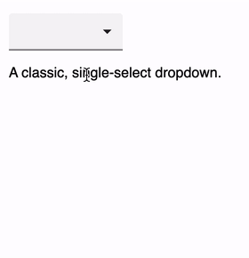
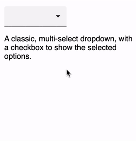
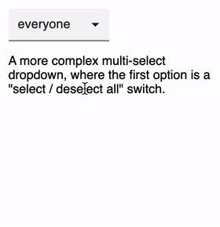
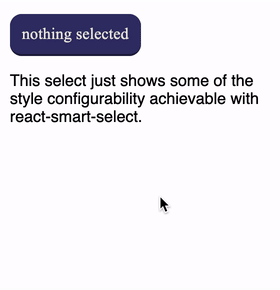

# React Smart Select

A small, responsive and highly configurable React form control. **react-smart-select** allows you to create single-select, multi-select and *toggle-select* controls, where the first item in the list can select and unselect the whole list.

* [Features](#features)
* [Examples](#examples)
* [Installation and usage](#installation-and-usage)
* [Styling](#styling)
* [Props](#props)

## Features

- Single and Multi select modes
- "Toggle" mode
- Responsive
- Custom label and option rendering
- Highly configurable styles
- Beautiful default styles
- Accessible WAI ARIA compliance
- Powered by [popper](https://popper.js.org/) and [styled-components](https://styled-components.com/)

## Examples

If you want to run a demo of **react-smart-select** just clone the repository and run `npm run start` or `yarn start` (it will automatically install all the dependencies).

### Single select

A classic, single-select dropdown.



### Multi select

A classic, multi-select dropdown, with checkboxes to show the selected options.



### Toggle select

A more complex multi-select dropdown, where the first option is a "select / deselect all" switch.



### Group select

With little effort it's possible to achieve advanced features like groups of options, where each group has a header that can select and deselect the whole group. You can find the code for this control in the demo app!


### Fancy select

This control just shows some of the style configurability achievable with **react-smart-select**.



### Responsive layout

On small screens **react-smart-select** switches to a responsive layout.


## Installation and usage

Install the library and its peer dependencies:

`npm install --save-dev react-smart-select styled-components @popperjs/core react-popper`

or:

`yarn add --dev react-smart-select styled-components @popperjs/core react-popper`

Example usage:

```jsx
import SmartSelect from 'react-smart-select';
import React, { useState } from 'react';

const options = [
  { label: 'alice', value: 'alice' },
  { label: 'bob', value: 'bob' },
  { label: 'carol', value: 'carol' },
  { label: 'dave', value: 'dave' }
];

export default function Form() {
  const [ value, onChange ] = useState();

  return (
    <SmartSelect value={value} options={options}
      onChange={onChange} />
  );
}
```

The `onChange` callback receives three arguments:

```js
  function onChange(value, selected, options) {
    ...
  }
```

* `value`: the current option (for single-select controls) or the array of currently selected 
  options (for multi-select and toggle-select controls).
* `selected`: the option the user just clicked.
* `options`: the list of the select's options.

## Styling

There are different ways to customize the appearance of **react-smart-select**.

### Style props

The simplest one is through the usual `style` props, which defines the style of the main component. Styles can also be applied to the various components through additional props:

- `labelStyle`
- `dropdownStyle`
- `optionStyle`

For example:

```jsx
const style = {
  backgroundColor: '#33336a',
  color:           '#efe8de',
  borderRadius:    '12px'
};

const optionStyle = {
  padding: '4px'
};

return (
  <SmartSelect value={value} options={options}
    style={style} optionStyle={optionStyle}
    onChange={onChange} />
);

```

### Stylesheets

Another way to change the component's appearance is through stylesheets. **react-smart-select** define the `smart-select` class, plus any additional ones you pass with the `className` prop. It also defines other classes on its main elements:

* `rss-label`
* `rss-dropdown`
* `rss-option`

Defining your own styles allows you to style pseudo-elements too, which is not possibile using React's `style` props. For example:

```css
.smart-select {
  font-family: 'Times New Roman', Time, serif;
}

.smart-select .rss-dropdown .rss-option:hover {
  background-color: #dac281;
  color: #efe8de;
}
```

### styled-components

**react-smart-select** uses [styled-components](https://styled-components.com/) for its styles, so you can use its API to wrap the component with your own styles.

Remember to declare your wrapped component *outside* any render method, as explained by styled-component's [FAQ](https://styled-components.com/docs/faqs#why-should-i-avoid-declaring-styled-components-in-the-render-method)


```jsx
import SmartSelect from 'react-smart-select';
import styled from 'styled-components';
import React, { useState } from 'react';

const Styled = styled(SmartSelect)`
  font-family: 'Times New Roman', Time, serif;

  .rss-dropdown .rss-option:hover {
    background-color: #dac281;
    color: #efe8de;
  }
`;

export default function StyledComponent() {
  const [ value, onChange ] = useState();

  return (
    <Styled value={value} options={options}
      onChange={onChange} />
  );
}
```

## Props

Props you may want to specify include:

- `onChange`: subscribe to change events
- `options`: specify the options the user can select from
- `value`: control the current option (i.e. the corresponding entry in the options array)
- `placeholder`: the placeholder value when no options are selected
- `className`: optional class name for the component
- `style`: optional style for the component
- `labelStyle`: optional style for the control label
- `dropdownStyle`: optional style for the dropdown box
- `optionStyle`: optional style for each dropdown menu item
- `formatLabel`: a function invoked to get the label content. Can return a string or a React component
- `formatOption`:  a function invoked to get each option content. Can return a string or a React component
- `disabled`: disable the control
- `multi`: enable the multi-select mode
- `toggle`: enable the toggle-select mode.

### Callbacks

You can control not only the component style, but its content too. You can pass the `formatLabel` and `formatOptions` callbacks to control what will be printed in each element. These callbacks can return a string or a React component.

The `formatLabel` function is called to format the content of the select's label. It is passed the current value and all the control's options. For single-select controls, `value` is either the current selected value or `null` if nothing is selected, while for multi-select controls it's the array of currently selected values or an empty array if nothing is selected.

Please note that if you specify this callbacks the placeholder prop will be ignored, as it is now your responsibility to render the correct label when value is null or an empty array.

```js
function formatLabel(value, options) {
  if (value === null) {
    return 'nothing selected';
  }

  return value.label;
}
```

The `formatOptions` function is called to format the content of each option. It is passed the option being rendered and a boolean indicating if it is currently selected or not.

```js
function formatOption(option, selected) {
  if (selected === true) {
    return (
      <strong>{option.label}</strong>
    );
  }

  return option.label;
}
```

## Licence

[MIT](LICENSE)
